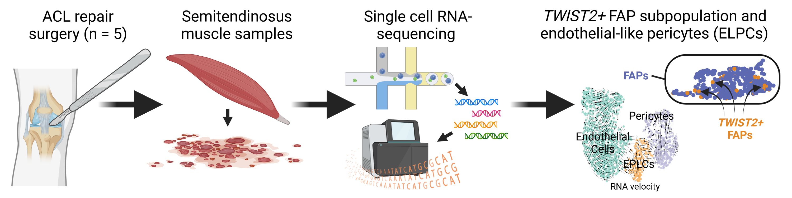

# Underexplored mesenchymal and vascular-related cell populations in human skeletal muscle

This repository contains code to reproduce the single-cell RNA-sequencing analysis from our manuscript __"Identification of underexplored mesenchymal and vascular-related cell populations in human skeletal muscle"__, now published in AJP-Cell Physiology, <a href="https://via.placeholder.com/1920x1080/c41616/ffffff.png?text=PLACEHOLDER+FOR+MANUSCRIPT+LINK" target="_blank">here</a>. Our data is deposited in the GEO repository and is available under the series record <a href="https://ncbi.nlm.nih.gov/geo/query/acc.cgi?acc=GSE216544" target="_blank">GSE216544</a>. Jupyter notebooks used to process the data are located in `scripts`.

### Contact
* Griffen Wakelin (Wakelin@dal.ca)
* Adam Johnston (AdamJohnston@dal.ca)
